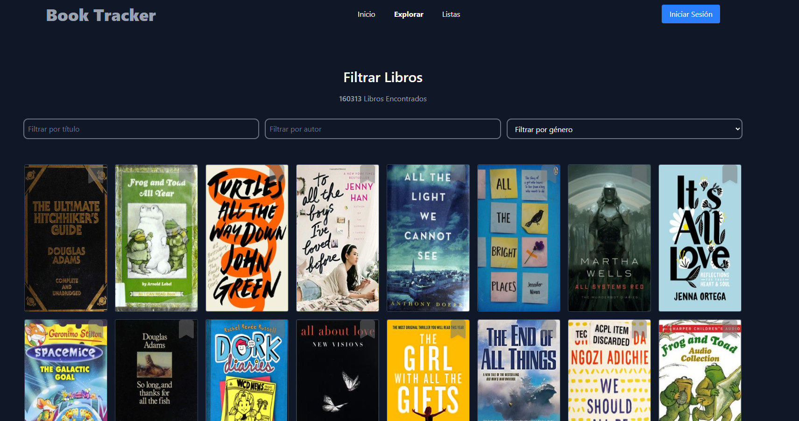
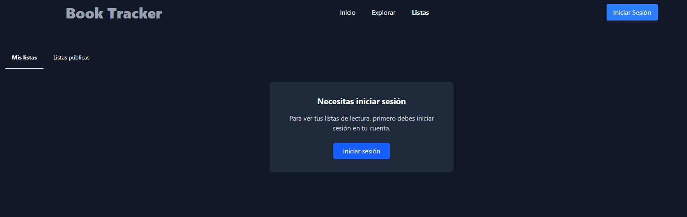
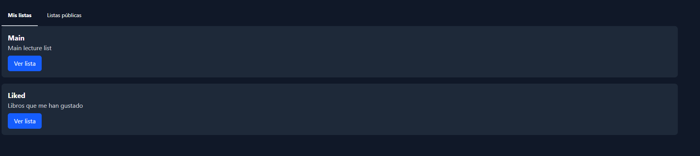
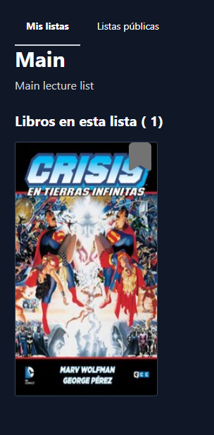
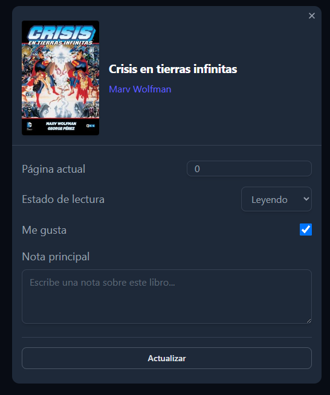

# Book Tracker

Book Tracker is a web application designed to help you manage and track your favorite books. Built with Astro, this application allows users to add books to their reading list, include lecture book details, and manage their reading progress.

## Table of Contents

- [Project Description](#project-description)
- [Demo Link](#demo-link)
- [Screenshots](#screenshots)
- [Features](#-features)
- [Future Features](#-future-features)
- [Project Structure](#-project-structure)
- [Commands](#-commands)
- [Technologies Used](#️-technologies-used)
- [Clerk Integration](#clerk-integration)
- [License](#-license)
- [Contributing](#-contributing)
- [Contact](#-contact)

## Project Description

Book Tracker is a web application designed to help you manage and track your favorite books. Built with Astro, this application allows users to add books to their reading list, view book details, and manage their reading progress. The application aims to provide a seamless and intuitive experience for book lovers to organize their reading journey.

## Demo Link

[https://booktracker-nickescolr.netlify.app/](https://booktracker-nickescolr.netlify.app/)

## Screenshots









## 📚 Features

- **Add books to the reading list**: Allows users to add books to their reading list.
- **View book details**: Displays information about each book, including title, author, genre.
- **Manage reading progress**: Users can update their reading progress.
- **Intuitive user interface**: A clean and easy-to-use user interface, built with reusable Astro components.
- **Save books to favorites**: Users can save books to favorites.

## 🔮 Future Features

- **Download and upload lecture list**: Allow users to download books in the list and upload it to persist their collection.
- **Social features**: Enable users to share their reading lists and progress with friends.
- **Advanced search**: Implement advanced search functionality to filter books by various criteria.
- **Create multiple lists**: Allow users to create different lists to better handle books.

## 🚀 Project Structure

Inside of your Astro project, you'll see the following folders and files:

```text
/
├── db/
│   ├── config.ts
│   ├── seed.ts
│   └── models/
│       ├── Books.ts
│       ├── LectureBooks.ts
│       ├── LectureListBook.ts
│       ├── lectureLists.ts
│       └── Notes.ts
├── public/
│   └── favicon.svg
├── src/
│   ├── assets/
│   ├── components/
│   │   ├── Hero.astro
│   │   ├── books/
│   │   │   ├── Bookmark.astro
│   │   │   ├── CardBook.astro
│   │   │   ├── DialogBookForm.astro
│   │   │   └── GridBooks.astro
│   │   ├── lists/
│   │   │   └── MyLectureLists.astro
│   │   └── ui/
│   │       ├── Footer.astro
│   │       ├── Header.astro
│   │       ├── SignInSignOutNav.astro
│   │       └── input.astro
│   ├── consts/
│   │   └── subjects.ts
│   ├── layouts/
│   │   ├── Layout.astro
│   │   └── ListsLayout.astro
│   ├── middleware.ts
│   ├── pages/
│   │   ├── books.astro
│   │   ├── index.astro
│   │   ├── api/
│   │   │   ├── lecture-book/
│   │   │   │   └── [lectureBookId].json.ts
│   │   │   └── lectureLists/
│   │   │       ├── [listId].json.ts
│   │   │       ├── main.json.ts
│   │   │       └── [listId]/
│   │   │           └── [lectureBookId].json.ts
│   │   └── lecture-lists/
│   │       ├── my-lists.astro
│   │       ├── public-lists.astro
│   │       └── my-lists/
│   │           └── [listId].astro
│   ├── store/
│   │   └── bookDialog.store.ts
│   ├── styles/
│   │   └── global.css
│   ├── types/
│   │   ├── OpenLibraryTypes.ts
│   │   └── db.types.ts
│   └── utils/
│       ├── booksApi.ts
│       └── lectureListUtils.ts
├── .env.template
├── astro.config.mjs
├── package.json
├── pnpm-lock.yaml
└── tsconfig.json
```

To learn more about the folder structure of an Astro project, refer to [our guide on project structure](https://docs.astro.build/en/basics/project-structure/).

## 🧞 Commands

All commands are run from the root of the project, from a terminal:

| Command                   | Action                                           |
| :------------------------ | :----------------------------------------------- |
| `bun install`             | Installs dependencies                            |
| `bun dev`                 | Starts local dev server at `localhost:4321`      |
| `bun build`               | Build your production site to `./dist/`          |
| `bun preview`             | Preview your build locally, before deploying     |
| `bun astro ...`           | Run CLI commands like `astro add`, `astro check` |
| `bun astro -- --help`     | Get help using the Astro CLI                     |

## 🛠️ Technologies Used

- **Astro**: A modern framework for building fast, optimized websites.
- **TypeScript**: A superset of JavaScript that adds static types.
- **pnpm**: A new, fast, and modern package manager.
- **Clerk**: For user authentication and management.
- **AstroDB**: Library to handle SQLite database.

## Clerk Integration

Clerk is used in this project to handle user authentication. It provides a secure and easy way to manage user sign-up, sign-in, and session management.

The userId provided by clerk is used to manage the lists for an specific user. Check permissions to handle a list and save the users lecture book information.

Key aspects of Clerk integration:

- **Authentication Middleware**: The `src/middleware.ts` file uses `clerkMiddleware` from `@clerk/astro/server` to protect routes and manage user sessions.
- **Environment Variables**: Clerk integration relies on environment variables such as `PUBLIC_CLERK_PUBLISHABLE_KEY` and `CLERK_SECRET_KEY` for its configuration. These are typically stored in a `.env` file (a `.env.template` is provided in the repository).
- **UI Components**: Clerk's pre-built UI components can be (or are planned to be) integrated for sign-in and sign-up flows, providing a seamless user experience. (Further details on specific components used can be added here as the project evolves).

## 📄 License

This project is licensed under the MIT License. See the [LICENSE](./LICENSE) file for more details.

## 🤝 Contributing

Contributions are welcome. If you would like to contribute, please follow these steps:

1. Fork the repository.
2. Create a new branch (`git checkout -b feature/new-feature`).
3. Make your changes and commit them (`git commit -m 'Add new feature'`).
4. Push to the branch (`git push origin feature/new-feature`).
5. Open a Pull Request.

## 📧 Contact

If you have any questions or suggestions, feel free to contact me
Thank you for using Book Tracker!
